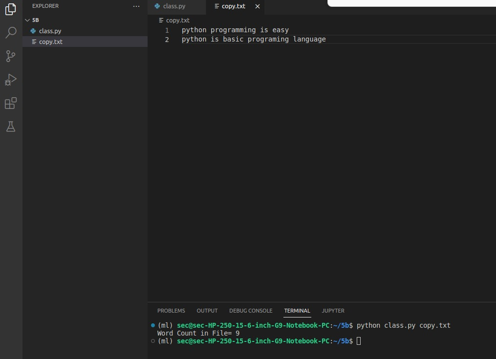

# command-line-arguments-to-count-word
## AIM:
To write a python program for getting the word count from the contents of a file using command line arguments.
## EQUIPEMENT'S REQUIRED: 
PC
Anaconda - Python 3.7
## ALGORITHM: 
### Step 1:

Import sys
### Step 2:

Initially make count = 0
### Step 3:

Open the content file using command line arguments.
### Step 4:

By using for loop name the function as "line"
### Step 5:

Split the line using .split
### Step 6:

Count the length of the word and print it
## PROGRAM:
```python
#Developed by : MUKIL KUMAR V
#ROLL NO : 22008798
import sys
count=0
with open(sys.argv[1],'r') as f:
        for line in f:
            word=line.split()
            count+=len(word)
print("Word Count in File=",count)

```
### OUTPUT:


<br>
<br>





## RESULT:
Thus the program is written to find the word count from the contents of a file using command line arguments.
